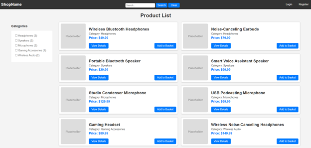
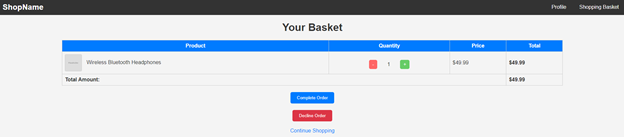

# AudioDeviseStore


## Table of Contents
- [Project Description](#project-description)
- [Installation Instructions](#installation-instructions)
- [Usage Instructions](#usage-instructions)
- [Features](#features)
- [Technologies Used](#technologies-used)
- [Screenshots](#screenshots)
- [License](#license)

## Project Description
AudioDeviseStore is a simple PHP project developed as a freelance educational assignment. It demonstrates basic concepts of a PHP-MVC system for an internet store, including CRUD operations and product management such as ordering, browsing, and filtering.

## Installation Instructions
1. Clone the repository:
   ```bash
   git clone https://github.com/yourusername/AudioDeviseStore.git
2. Set up your local PHP environment.
3. Import the database:
- Open PHPMyAdmin.
- Create a new database.
- Import the provided SQL file into the newly created database.

## Usage Instructions
This project is for free use and serves as a demonstration of basic concepts. Feel free to explore the functionalities, including product filtering, simple basket and ordering logic, registration, and user profile management.

## Features
- Filtering of existing products.
- Simple basket and ordering logic.
- User registration and profile management.

## Technologies Used
- PHP
- MySQL

## Screenshots
Include some screenshots of your project to provide a visual overview.

### Home Page


### User Registration


### Shopping Basket


## License
This project is not licensed. You are free to use and modify it for educational purposes.
